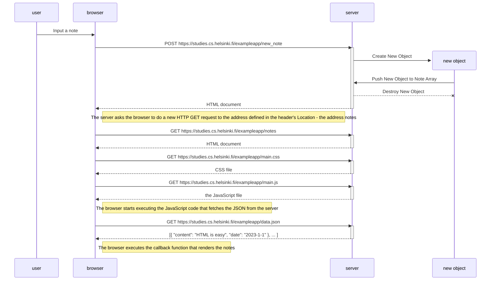

```mermaid
sequenceDiagram
    participant user
    participant browser
    participant server


    user->>browser: Input a note

    browser->>server: POST https://studies.cs.helsinki.fi/exampleapp/new_note
    activate server
    create participant new object
    server->>new object: Create New Object
    new object->>server: Push New Object to Note Array
    server--xnew object: Destroy New Object

    server-->>browser: HTML document
    deactivate server

    Note right of browser: The server asks the browser to do a new HTTP GET request to the address defined in the header's Location - the address notes

    browser->>server: GET https://studies.cs.helsinki.fi/exampleapp/notes
    activate server
    server-->>browser: HTML document
    deactivate server

    browser->>server: GET https://studies.cs.helsinki.fi/exampleapp/main.css
    activate server
    server-->>browser: CSS file
    deactivate server

    browser->>server: GET https://studies.cs.helsinki.fi/exampleapp/main.js
    activate server
    server-->>browser: the JavaScript file
    deactivate server

    Note right of browser: The browser starts executing the JavaScript code that fetches the JSON from the server

    browser->>server: GET https://studies.cs.helsinki.fi/exampleapp/data.json
    activate server
    server-->>browser: [{ "content": "HTML is easy", "date": "2023-1-1" }, ... ]
    deactivate server

    Note right of browser: The browser executes the callback function that renders the notes
```
